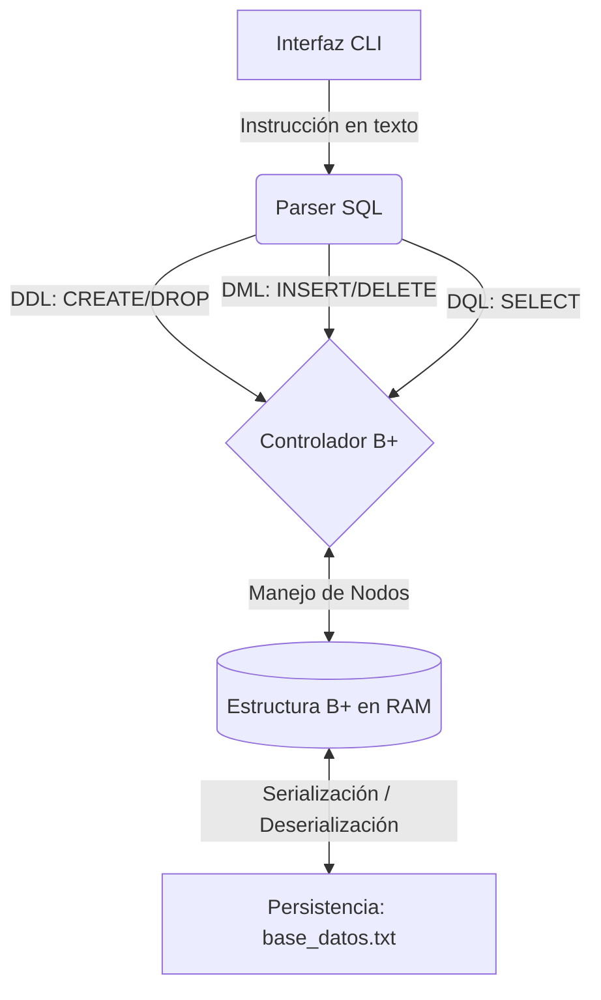

# Especificación del Parcial 2: Motor de Base de Datos SQL (Árboles B+)

Este documento establece los requerimientos, la arquitectura esperada y la rúbrica de evaluación para el desarrollo del Motor de Base de Datos SQL basado en Árboles B+.

> [!IMPORTANT]
> **Fecha límite de entrega:** Viernes 18 de septiembre a las 12:00 M (Mediodía).
> **Plataforma:** Buzón de entrega de EAFIT Interactiva.

---

## 1. Descripción del Problema

El objetivo fundamental de la práctica es consolidar los conceptos de **Estructuras de Datos y Algoritmos**. Para ello, se requiere completar un esqueleto de código en `C++` que conecta un analizador léxico/sintáctico de comandos SQL (Parser) con una estructura de almacenamiento persistente basada en **Árboles B+**.

El sistema procesará instrucciones en formato de texto (DDL y DML/DQL), interactuará de manera eficiente con el árbol B+ en memoria principal y garantizará la persistencia de los datos en un archivo físico (`base_datos.txt`).

## 2. Arquitectura del Sistema

El proyecto está diseñado bajo una separación de responsabilidades en tres capas principales:

*   **Interfaz CLI (`main.cpp`):** Mantiene el ciclo de ejecución interactivo (REPL).
*   **Analizador SQL (`AnalizadorSQL`):** Extrae la semántica de la consulta (operación a realizar) y sus argumentos.
*   **Estructura de Datos (`ArbolBPlus`):** Implementa estrictamente los algoritmos de ordenamiento, búsqueda, división (*split*) y barrido secuencial característicos de los árboles B+.

---

## 3. Comandos SQL Soportados y Propósito Estructural

El analizador debe soportar el siguiente subconjunto de comandos SQL, cada uno diseñado para evaluar una competencia específica sobre estructuras de datos.

### 3.1. Lenguaje de Definición de Datos (DDL)
*   `CREATE TABLE <nombre> (columnas...)`: Instancia y reserva memoria para el Árbol B+ primario.
*   `CREATE INDEX <nombre> ON <tabla> (<columna>)`: **Evaluación de Índices.** Requiere la creación de un segundo Árbol B+ independiente. La clave de este árbol será la columna solicitada y su valor apuntará a la clave primaria original.
*   `DROP TABLE <nombre>`: Libera la memoria (nodos) y destruye el archivo de persistencia asociado.

### 3.2. Lenguaje de Manipulación y Consulta (DML / DQL)
*   `INSERT INTO <nombre> VALUES (<id>, <datos>)`: **Evaluación de Inserción.** Prueba el algoritmo de inserción ordenada, el manejo de capacidad máxima por nodo y el algoritmo de división (*split*) con propagación ascendente de claves.
*   `SELECT * FROM <nombre>`: **Evaluación de Recorrido Secuencial.** Demuestra el uso correcto del puntero de hojas continuas en el Árbol B+ (simulando un *Full Table Scan*).
*   `SELECT * FROM <nombre> WHERE id = <id>`: **Evaluación de Búsqueda Logarítmica.** Verifica el descenso correcto desde el nodo raíz hasta la hoja específica en tiempo de complejidad O(log N).
*   `DELETE FROM <nombre> WHERE id = <id>`: *(Bonus)* **Evaluación de Eliminación.** Prueba la fusión (*merge*) de nodos y la redistribución bajo la condición de subdesbordamiento (*underflow*).

---

## 4. Rúbrica de Evaluación

| Criterio | Ponderación | Descripción de la competencia a evaluar |
| :--- | :---: | :--- |
| **Operación INSERT** | 25% | Correcta división (*split*) de nodos llenos, promoción de claves al nodo padre y manejo de la raíz dinámica. |
| **Integración del Parser** | 20% | Extracción precisa de los identificadores y valores (cadenas/enteros) de la instrucción SQL hacia los métodos del árbol. |
| **Búsqueda Logarítmica (SELECT)** | 15% | Descenso correcto por los nodos internos utilizando las claves de búsqueda hasta llegar al registro en las hojas. |
| **Índices Secundarios** | 15% | Sincronización e instanciación de un segundo Árbol B+ ante la creación de un `INDEX`. |
| **Persistencia de Datos** | 15% | Carga y guardado correcto del estado del árbol hacia el archivo plano secuencial. |
| **Estructura y Claridad** | 10% | Código legible, uso adecuado de punteros, separación de responsabilidades y modularidad. |
| **Operación DELETE (Bono)** | +10% | *Opcional:* Resolución correcta de underflow (préstamos entre hermanos o fusión/merge). |

---

## 5. Condiciones y Reglas de Entrega

> [!WARNING]
> El incumplimiento de las siguientes restricciones algorítmicas anulará el componente correspondiente en la rúbrica.

1.  **Restricciones de Implementación:**
    *   No se permite el uso de motores de bases de datos preexistentes (SQLite, etc.).
    *   **Prohibido** el uso de estructuras asociativas estándar de C++ (como `std::map` o `std::set`) para reemplazar el núcleo del Árbol B+. Todos los nodos deben manejarse manualmente a través de punteros.
2.  **Modalidad de Trabajo:** Se permite el trabajo individual o en equipos (máximo 3 personas).
3.  **Metodología de Entrega:**
    *   Empaquetar el código fuente (`.cpp`, `.h`, `Makefile`) en un único archivo comprimido `.zip`.
    *   Es estrictamente obligatorio que **todos los integrantes del equipo** suban el archivo `.zip` al buzón correspondiente en EAFIT Interactiva para dejar evidencia individual.
4.  **Sustentación:** La entrega estará sujeta a una sustentación del código presentado, con énfasis en explicar la complejidad algorítmica de la operación de inserción.
